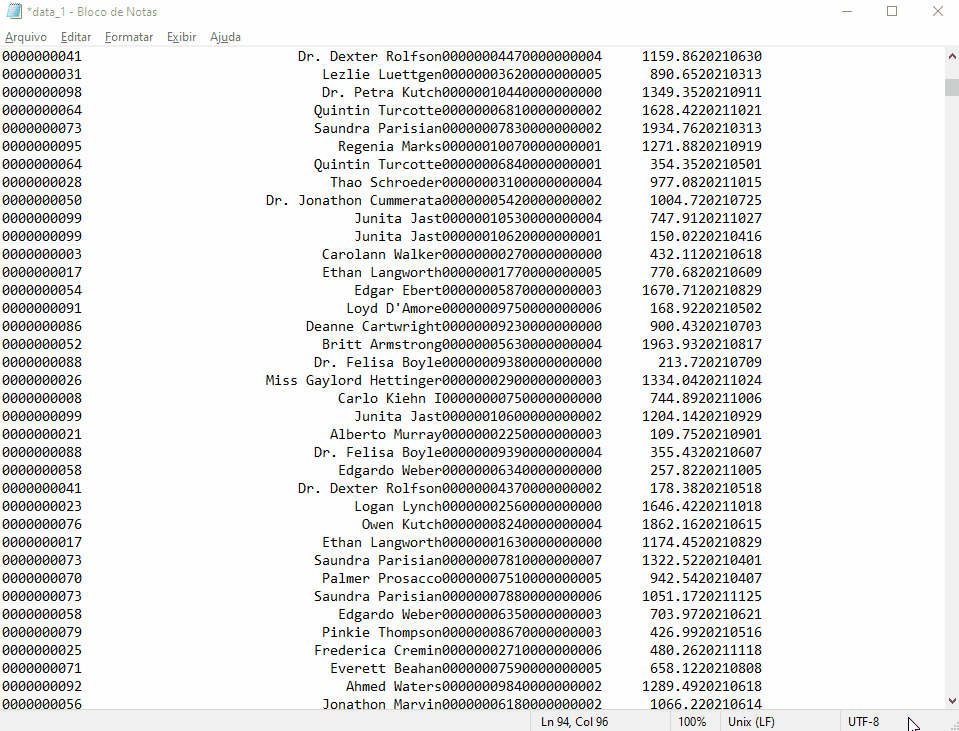
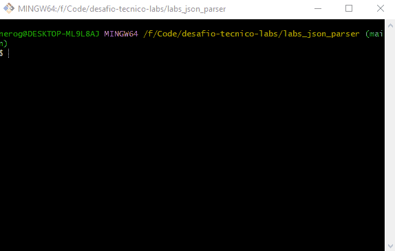
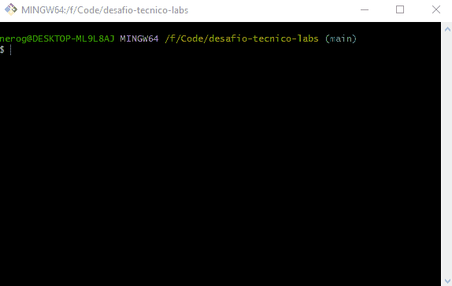

# Desafio Tecnico Labs

## Cenário do projeto
Temos uma demanda para integrar dois sistemas. Um desses sistemas é legado e possui um arquivo de pedidos desnormalizados. Sendo assim, precisamos transforma-los em um arquivo json normalizado para então enviar para o outro sistema. Para que isso seja possível, precisamos satisfazer alguns requisitos.

### Objetivo:
Faça um sistema que receba um arquivo ou diretório e processe-os para um novo formato.

### Entrada de Dados:
O arquivo do sistema legado possui uma estrutura em que cada linha representa uma parte de um pedido. Os dados estão padronizados por tamanho de seus valores, respeitando a seguinte tabela:

| campo         | tamanho  | tipo                |
|:--------------|:---------|:--------------------|
| id usuário    | 10       | numérico            |
| nome          | 45       | texto               |
| id pedido     | 10       | numérico            |
| id produto    | 10       | numérico            |
| valor produto | 12       | decimal             |
| data compra   | 8        | numérico (yyyymmdd) |



### Saída de Dados
O formato de saída esperado deve seguir a seguinte estrutura:

```json
[
  {
    "user_id": 1,
    "name": "Zarelli",
    "orders": [
      {
        "order_id": 123,
        "total": "1024.48",
        "date": "2021-12-01",
        "products": [
          {
            "product_id": 111,
            "value": "512.24"
          },
          {
            "product_id": 122,
            "value": "512.24"
          }
        ]
      }
    ]
  }
]
```

## 🚀 Executando a aplicação

### Pré-requisitos
Este projeto foi construído utilizando o Maven e Java 11 com o mínimo de bibliotecas possíveis. Sendo assim, ambos são necessarios para executar o projeto.

### Compilação
Para compilar o projeto basta rodar o comando `mvn clean install`. O `.jar` será gerado na pasta `target`.

### Executando
Para executar o sistema, basta entrar na pasta target com `cd ./target` e
então execute o jar, podendo passar o diretório/arquivo a ser analisado. Por exemplo:
`java -jar labs_json_parser-1.0.jar C:\User\Documents\data_1.txt`. Case o diretório
não seja informado pelos argumentos o programa irá solicitar durante a execução.



### Saida de Dados:
Um novo arquivo `.json` será gerado no mesmo diretório informado durante
o início da aplicação com os dados formatados. 

## 🧪 Executando testes únitarios
Os testes únitarios foram desenvolvidos utilizando o JUnit 4. Para executalos, 
basta digitar `mvn teste` na pasta raiz do projeto `labs_json_parser`

