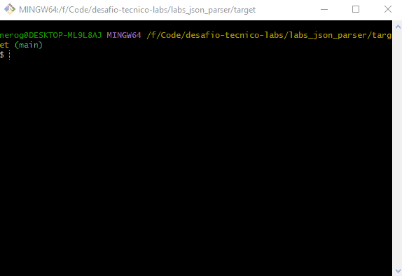

# Instruções de Execução
Este projeto foi construído utilizando o `Maven` e `Java 11` com o mínimo de bibliotecas possíveis.

### Compilação:
Para compilar o projeto basta acessar a pasta `labs_json_parser` e em
seguida rodar o comando `mvn clean install`. O `.jar` será gerado na pasta `target`.

### Executando:
Para rodar o sistema, basta entrar na pasta target com `cd ./target` e
então execute o jar, podendo passar o diretório/arquivo a ser analisado. Por exemplo:
`java -jar labs_json_parser-1.0.jar C:\User\Documents\data_1.txt`. Case o diretório
não seja informado pelos argumentos o programa irá solicitar durante a execução.

### Saida de Dados:
Um novo arquivo `.json` será gerado no mesmo diretório informado durante
o início da aplicação com os dados formatados. 